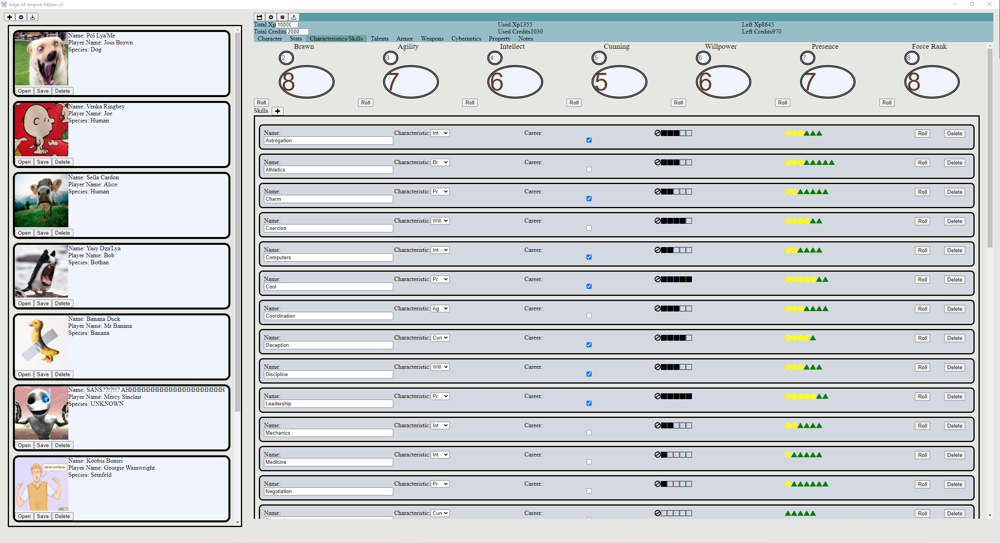

# Star Wars Tabletop RPG Helper V3

A character sheet, dice roller, and discord remote for Star Wars Tabletop RPGs. 

Streamlines the online RPG experience by sending [FFGNDS Discord Dice Roller](https://github.com/SkyJedi/FFGNDS-Discord-Dice-Roller) commands to Discord from the push of a button on your character sheet.



## Instalation

Download the latest build from the releases page.

### Windows

Clicking on the `.exe` file will automatically run the Installer. It will look like a green animated box in the middle of your screen, and will automatically install to your default drive's Program Files.

### Ubuntu/Linux

Install the `.deb` file by running `sudo dpkg -i NAME_OF_DEB_FILE_GOES_HERE`.

The default save directory is in the `.config` folder.

## Getting Started

Press the plus in the top right corner to create a new character.

Press the arrow pointing down in the top right corner to import a character.

Open a character, press the arrow pointing up at the top to export a json file.

## Setting up Discord

> __Warning__
> Connecting this app to Discord is technically prohibited by the Discord TOS and can lead to the account block.
> We don't take any responsibility for blocked Discord accounts.

If you want to connect the app to your discord:
1. First you will need to get your discord token, The following has been copied from [Discord.js](https://www.npmjs.com/package/discord.js-selfbot-v13) documentation.
	1. Log into discord in your browser.
	2. Press CTRL+SHIFT+I to open the inspector.
	3. Click on the "Console" tab
	4. Paste the folowing into the console(It will automatically be copied to your clipboard and loged to the console)
		```
		window.webpackChunkdiscord_app.push([
		[Math.random()],
		{},
		req => {
			for (const m of Object.keys(req.c)
				.map(x => req.c[x].exports)
				.filter(x => x)) {
				if (m.default && m.default.getToken !== undefined) {
					console.log(m.default.getToken())
					return copy(m.default.getToken());
				}
				if (m.getToken !== undefined) {
					console.log(m.getToken())
					return copy(m.getToken());
				}
			}
		},]);
		console.log('%cWorked!', 'font-size: 50px');
		console.log('You now have your token in the clipboard!', 'font-size: 16px');
2. Now that you have your Discord token, press the gear icon at the top left of the screen to open Global Settings.
3. Paste your Discord token into the text box.
4. Press OK (This will log you in).
5. Get the Discord Channel ID from your Discord Server Admin with the [FFGNDS Discord Dice Roller](https://github.com/SkyJedi/FFGNDS-Discord-Dice-Roller) bot installed.
	1. This can be done, as an admin, by right clicking on a channel and clicking `Copy ID`.
6. Select a character and press the gear icon at the top of the screen to open Character Settings.
7. Paste Channel ID into the channel ID text input.
8. Test it out by clicking 

## Contributers


This app uses an Electron backend and a React.js frontend. 

The Electron side almost exclusively handles i/o operations, all of the important features are happening in the React.

### Requirements
- npm

### Setup
1. run `npm install` to install all requirements.
2. run `npm start` to start the electron app.

### Building
1. run `npm run make` to make a build for your system (i.e. Windows users can only make Windows builds). the output should be in the `out` folder.

### Useful Information
- The entry point of the app is in `main.js` at the top level.
- The entry point for the frontent app is `template/javascript/main.js`
- There are 2 really important global variables
	- `window.api`
		- How the app calls the backend. (reading/writing to disk, handling discord, etc...)
	- `window.data`
		- The app is set up as a pseudo Model View Controller app where `window.data` is the model.
		- Components can change `window.data` and then add hooks to listen when `window.data` has changed.
	- All icons are in `IconFonts.woff2` and defined in `icons.css`.


